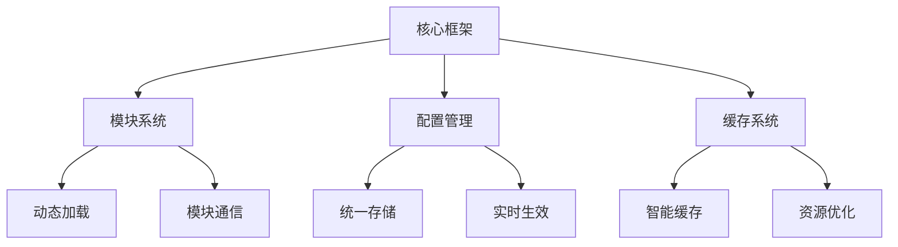

# 星渊NS助手

[📦 安装脚本](https://greasyfork.org/zh-CN/scripts/523819) | [📖 使用文档](https://github.com/stardeep925/NSaide/wiki) | [💬 加入交流群](https://t.me/NSaide) | [📢 官方频道](https://t.me/NSaide_channel)

> NS助手是一个基于 Tampermonkey 的轻量级开源增强框架，专为 NodeSeek论坛 打造。秉承"简约而不简单"的设计理念，采用优雅的模块化架构，为用户提供流畅、高效的功能扩展体验。

🎯 框架特点

### 🌟 优雅简约
<table>
<tr>
<td>
  
- 极简主义的设计理念，追求简单直观的用户体验
- 优雅的代码组织结构，基于ES6+模块化规范
- 清晰的模块化架构，每个功能都是独立的模块
- 流畅的用户交互体验，无感知的功能加载

</td>
</tr>
</table>

### ⚡ 轻量高效
<table>
<tr>
<td>
  
- 核心代码轻量化设计，无需额外依赖
- 模块按需加载，最小化资源占用
- 智能的缓存管理机制，优化数据加载性能
- 统一的存储接口封装，高效的数据处理

</td>
</tr>
</table>

### 🔄 智能更新
<table>
<tr>
<td>
  
- 远程动态加载模块，支持热插拔
- 实时自动更新功能，无需重新安装
- 无感知功能升级，零等待更新体验
- 智能的模块版本控制，确保加载最新内容

</td>
</tr>
</table>

### 🛡️ 安全可控
<table>
<tr>
<td>
  
- 模块完全独立运行，互不干扰
- 基于GitHub托管模块，代码开源透明
- 严格的安全策略，模块运行环境隔离
- 完善的错误处理机制，确保稳定运行

</td>
</tr>
</table>

### 🔌 模块化设计
<table>
<tr>
<td>
  
- 模块间零耦合，独立的运行环境
- 灵活的开关控制，可随时启用/禁用
- 简洁的模块注册机制，标准化的接口设计
- 统一的设置管理，支持实时生效

</td>
</tr>
</table>

### 🎨 开发友好
<table>
<tr>
<td>
  
- 简单的模块开发流程，快速上手
- 标准化的模块接口，降低开发难度
- 灵活的样式注入系统，避免样式冲突
- 完善的事件系统，支持模块间通信

</td>
</tr>
</table>

💡 技术亮点

<table>
<tr>
<td>
  
| 特性 | 描述 |
|------|------|
| 🔄 动态更新机制 | 采用远程模块加载，实现无感知更新 |
| 📦 智能缓存策略 | 创新的缓存控制，确保内容时效性 |
| 🚀 按需加载系统 | 模块随用随载，优化资源使用 |
| ⚡ 实时响应机制 | 配置更改实时生效，提升体验 |
| 🔒 安全存储方案 | 模块代码托管GitHub，开源透明 |
| 🛡️ 独立运行环境 | 严格的模块隔离，确保稳定性 |
| 🌐 开放生态系统 | 支持社区贡献，共建模块生态 |

</td>
</tr>
</table>

🔧 技术架构

<table>
<tr>
<td>
  

- 基于原生 JavaScript 开发，无需额外依赖
- 采用 ES6+ 模块化规范
- 支持热插拔的模块注册机制
- 内置模块间通信机制
- 统一的存储接口封装
- 灵活的样式注入系统

</td>
</tr>
</table>

## 🚀 快速开始

### 📥 安装

<table>
<tr>
<td>

1. 首先安装 [Tampermonkey](https://www.tampermonkey.net/) 浏览器扩展
2. 点击  安装
3. 安装完成后访问 [NodeSeek论坛](https://www.nodeseek.com) 即可使用

</td>
</tr>
</table>

### 📝 使用说明

<table>
<tr>
<td>

安装后脚本会自动运行，您可以通过以下方式管理：

1. 点击浏览器扩展栏的 Tampermonkey 图标
2. 在弹出的面板中可以：
   - ✨ 开启/关闭各个功能模块
   - ⚙️ 自定义各模块的具体设置
   - 🎨 调整界面外观
   - ⌨️ 设置快捷键

</td>
</tr>
</table>

## 🔧 功能模块

<table>
<tr>
<td>

| 模块 | 说明 | 状态 |
|------|------|------|
| ⚙️ 设置面板 | 统一的设置界面，方便管理所有功能 | ✅ |
| 👤 用户卡片增强 | 增强用户信息卡片的显示效果 | ✅ |
| 📝 编辑器增强 | 为编辑器添加快捷键等功能 | ✅ |
| 📅 自动签到 | 自动完成论坛签到 | ✅ |
| 🎨 UI美化 | 提供网站界面美化和自定义主题功能 | ✅ |
| 📄 自动翻页 | 支持帖子列表和评论区的自动加载 | ✅ |
| 🏷️ 等级标签 | 为用户名和帖子添加等级标签显示 | ✅ |
| 💬 快捷回复 | 提供快捷回复功能 | ✅ |
| 👁️ 内容预览 | 自动获取帖子内容并显示在标题下方 | ✅ |

</td>
</tr>
</table>

## 🤝 参与贡献

<table>
<tr>
<td>

欢迎参与项目贡献！您可以：

- 🐛 提交 [Bug报告](https://github.com/stardeep925/NSaide/issues/new?template=bug_report.md)
- 💡 提出 [新功能建议](https://github.com/stardeep925/NSaide/issues/new?template=feature_request.md)
- 📝 改进 [文档](https://github.com/stardeep925/NSaide/wiki)
- 🔧 提交 [Pull Request](https://github.com/stardeep925/NSaide/pulls)

</td>
</tr>
</table>

## 📬 交流反馈

<table>
<tr>
<td>

- 💬 Telegram 交流群：[NSaide](https://t.me/NSaide)
- 📢 Telegram 频道：[NSaide_channel](https://t.me/NSaide_channel)
- 📧 问题反馈：[GitHub Issues](https://github.com/stardeep925/NSaide/issues)

</td>
</tr>
</table>

## 📄 许可证

<table>
<tr>
<td>

本项目采用 [GPL-3.0](LICENSE) 许可证。

</td>
</tr>
</table>

---

**Star History**

Made with ❤️ by [stardeep](https://github.com/stardeep925)

 